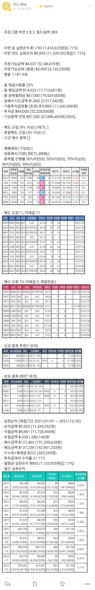

# 해외주식 스마트 RPA \[지니RPA] 

이 프로그램은 사람이 직접 계산하고, HTS에 입력하는것을 프로그램이 HTS를 대신 실행 및 입력 해주는 RPA일 뿐 특정 매매방법을 추천하거나, 특정 종목을 추천하지 않고, 투자관련 어떠한 판단도 없으며, 수익을 보장해주지 않습니다.

이 프로그램을을 통한 투자여부에 대한 모든 판단 및 결정은 프로그램 사용자 스스로 하시면 되며, 결과에 대한 책임 또한 사용자 본인에게 있습니다.

현재 지원하는 증권사는 아래와 같습니다.

* 메리츠 증권
* 키움증권

이 프로그램의 철학과, 주요 기능에 대한 배경 및 설명은 [개발일지](https://cafe.naver.com/infinitebuying/3548) 를 읽어서 참고하세요.**(최소 1과 6, 8은 읽으시길 권장합니다.)**


도움말의 처음 설정하기 는 반드시 해야하고, 자주하는질문(FAQ)에 대부분 문제점을의 해결할 수 있습니다.

퀵가이드를 보면 빠르게 사용하는 법을 알수 있습니다.


**주요 핵심기능은**

> * **보유하고 있는 종목을 자동으로 가져오기**
> * **종목별 원금, 사용자가 설정한 매매에 따라 매매개수, 가격, 매도 개수, 매도가격을 자동으로 계산**
> * **진행률 자동 계산 및 진행률에 따른 매수, 매도**
> * \*\*종목별 원금 계산(\*\*남은 투자금, 균등 배분, 고정원금) **설정**
> * **실현손익, 투자대비 수익률 표시**
> * **스마트 RPA 및 투자내역 카카오톡/메일 알림 및 자동 기록**
> * **여러개의 계좌, 여러사람 한번에 매매 가능**
> * **일일 매수시도금액, 예수금 자동계산 및 미사용, 초과사용 알림**
> * **오후 7시 이전 원화주문 설정**
> * **영웅문 글로벌(HTS) 간편인증/공동인증서 관계 없이 스마트 로그인**
> * **사용자가 설정한대로 반복 실행**

> **즉 매매 데이터 계산과 매매로 시간을 단축시켜주며, 주문 실수를 최대한 방지해 줍니다.**
>
> **매매 외에도 스마트 비서 기능으로 투자금, 예수금 관리, 신규종목 검색, 투자 대비 수익률, 원화주문 설정등을 관리 해줍니다.**
>
> **편안함에 이르시기를 바랍니다** :smile:**\*\*\*\***


프로그램 다운로드

[https://github.com/kskyj/RPA\_AutoUpdate/releases/download/latest\_Genie\_RPA/Genie\_RPA\_Setup.exe](https://github.com/kskyj/RPA_AutoUpdate/releases/download/latest_Genie_RPA/Genie_RPA_Setup.exe)

키움증권 전용 구버젼(2.x)

[https://github.com/kskyj/RPA\_AutoUpdate/releases/download/latest/kskyj\_RPA\_Setup.exe](https://github.com/kskyj/RPA_AutoUpdate/releases/download/latest/kskyj_RPA_Setup.exe)

