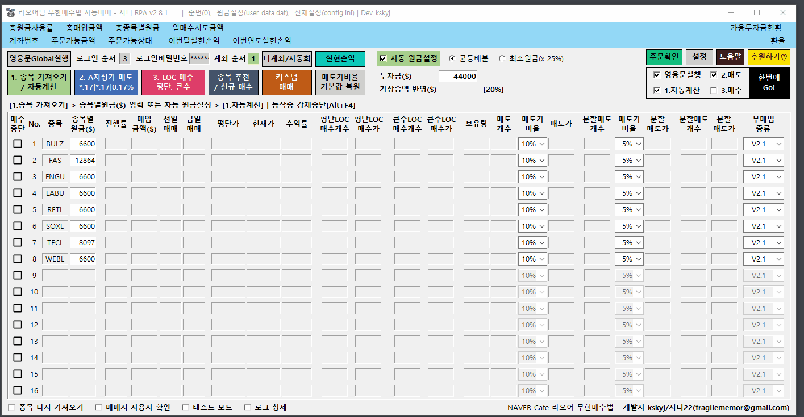

# ♾️ Full Automatic Mode(완전 자동화) 설정 및 응용

## Full Automatic Mode(완전 자동화) 시연


[**https://youtu.be/yj4iGCGOB3E**](https://youtu.be/yj4iGCGOB3E)


## 필수사항(사전 준비사항)

* PC 자동으로 켜지기 (메인보드 설정/스마트플러그/스위치봇등) 또는 PC 끄지 않기
* 윈도우 자동로그인(암호 없이 로그인)
* 윈도우 사용자계정컨트롤 끄기(영웅문이나 RPA 실행시 확인나오는경우)
* PC/노트북/가상클라우드 PC(vultr 추천, amazon등)


가상 클라우드 PC / 서버 호스팅을 사용하는 경우 크롬 원격데스크톱으로 연결 후 접속 종료를 하지 않고 디스플레이를 유지해야 합니다.

mstsc등의 마이크로소프트 Remote Desktop으로 연결하고 정상종료하는 경우 디스플레이가 유지되지 않습니다.

Vultr 경우 기본 View Console을 사용하면 관계 없습니다.



AWS Free Tier 로도 동작 가능합니다.


## 완전자동화 스마트 자동 등록

Full Automatic Mode(완전자동화) 등록시 다인용 런처에 설정된 내역으로 설정한 시간에 따라 사용자 순차대로 자동으로 동작합니다.

1. RPA내 \[다계좌/자동화] 를 클릭합니다.
2. 순번에 자동매매를 할 여러계좌, 여러사람을 설정합니다. 상세내용은 가이드내 "여러계좌 여러사람 편리하게 쓰는 \[다계좌/자동화] 다인용 런처"를 참고하세요
3. 마지막 사용자 매매 후 윈도우 자동종료 여부를 선택합니다.
4. 매도/매수 함께실행 또는 매도와 매수 분리실행 방법을 선택합니다.
5. 시작할 시간을 설정하고 \[스케줄 등록/변경] 을 실행합니다.
6. 자동으로 실행된 작업스케줄러에서 정상등록 되었는지 확인 합니다.


모두 한번에GO!(Full Automatic Mode)테스트 \[매매 안함] 을 통해 완전자동화 테스트가 가능합니다.



사용자 이름이 없는 경우 완전자동화 등록시 건너 뜁니다.



여러 작업 시간이 겹칠 경우 정상동작 하지 않습니다.



컴퓨터를 자동으로 켜지게 하는 경우 컴퓨터 켜지는 시간과 자동화 작업 시작시간을 5분정도 여유를 두도록 설정하십시오.


## AWS Free Tier 관련 링크

#### **1.** AWS Free Tier 윈도우 서버 생성하기

{% embed url="https://richspy.tistory.com/entry/%EC%95%84%EB%A7%88%EC%A1%B4-AWS-%EC%9C%88%EB%8F%84%EC%9A%B0-%EC%84%9C%EB%B2%84-%EB%AC%B4%EB%A3%8C-%EC%82%AC%EC%9A%A9-%EA%B0%80%EC%9D%B4%EB%93%9C" %}

2. 윈도우10 한글로 변경하기



참고. 1년 뒤 AWS Free Tier 삭제하기




AWS Free Tier 는 1년만 무료이고, 새로운 계정을 만들면 Free Tier 생성이 가능합니다.


## 사례

#### **1. PC 자동 시작, Full Automatic Mode 설정(홈런타짜 님)**



#### 클라우드 컴퓨터에서 실행 vultr\[5$/월]\(NAIL말고 지금 님)


