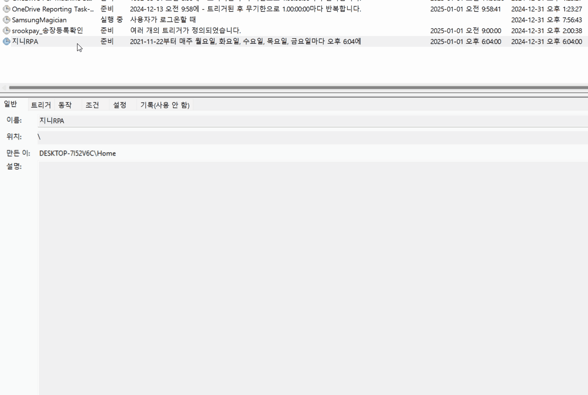

# 조회모드 설정

## 조회모드 등록방법 


이미 등록된 지니RPA 스케줄러를 복사해서 시간만 변경하는것으로, 등록된 지니RPA 스케줄러가 필요합니다.


<figure><figcaption></figcaption></figure>

1. 작업 스케줄러 실행
2. 지니 RPA 내보내기 실행
3. 작업가져오기로 지니RPA\_조회 등록
4. 지니RPA\_조회시간 변경
5. 예약된 시작시간을 놓친 경우 가능한 대로 빨리 작업 시작 체크 해제

<figure><figcaption></figcaption></figure>


조회모드 시간이 지나고 실행되면 실제 매매가 될 수 있으므로, \[예약된 시작 시간을 놓친 경우 가능한 대로 빨리 작업 시작] 은 체크 해제 하세요.

