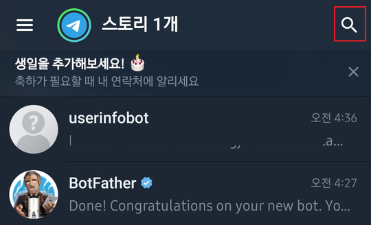
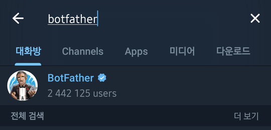
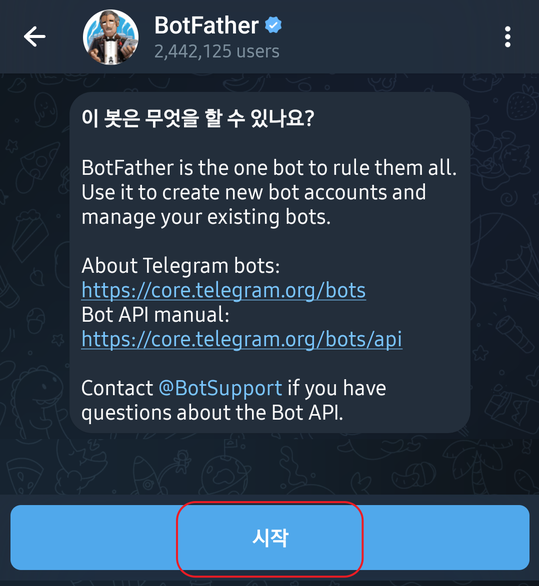
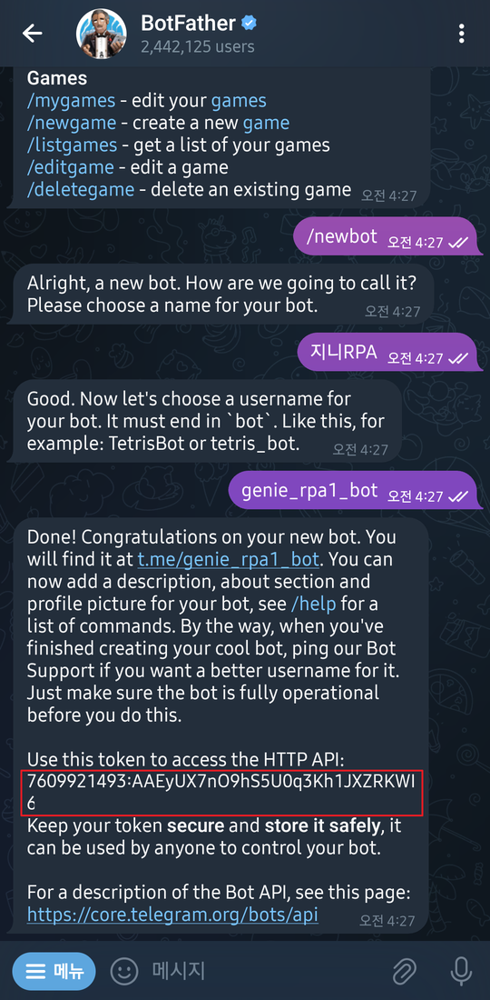
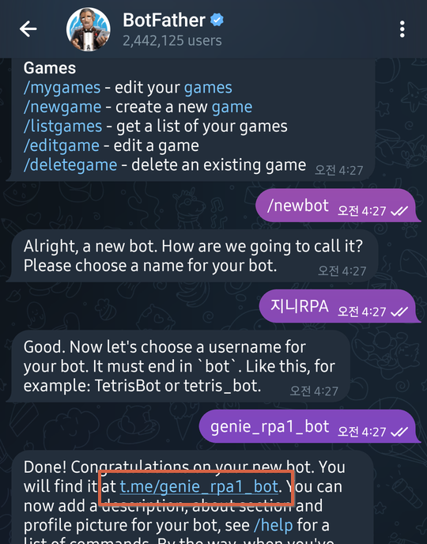
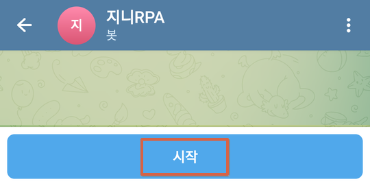
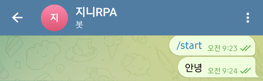
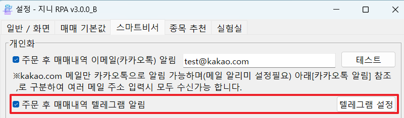
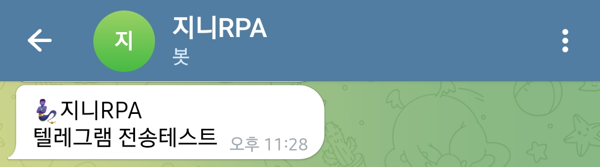

# 텔레그램 알림 설정

프로그램을 통해 매도, 매수가 성공하면 주문 분석결과를 보여주며 텔레그램으로 알림을 받을수 있습니다.

### 구글 Play Store 또는 App store 에서 Telegram 검색 해서 설치 및 가입

### BotFather를 통해 Token 생성

\
1\. 프로그램의 대화방 상단 위 돋보기 클릭

\
2\. botfather 검색


동일, 유사한 이름이 많으므로 가이드에 보이는 아이콘 선택


\
2\. botfather 선택 후 대화를 하고 나서 `시작` 선택   

\
3\. botfather 대화창에 3가지 입력

* /newbot 명령어 실행
* 대화방 봇 이름 지정 (지니RPA 또는 원하는것)
* 봇이름 영문으로 작성, 중복 허용 안되며 마지막에 \_bot 들어가야함   
   

4\. 위의 3가지 명령어를 다 했다면, 빨간색 네모를 클릭하면 Token을 확인

### Bot 활성화

1\. BotFather 의 생성한 bot 링크 클릭

2\. 이동한 봇 대화를 하고 나서 `시작` 선택

3\. 이동한 봇 에 아무말이나 걸어주기

### 지니 RPA에 입력 및 테스트

1\. 설정 > 스마트비서 > 주문 후 매매내역 텔레그램 알림 체크
2\. 텔레그램 설정 클릭

3\. `테스트` 발급급한 Token 입력

4\. `테스트` 버튼을 클릭하여 텔레그램에 알람 왔는지 확인
5\. `저장후 닫기` 버튼을 클릭하여 저장
