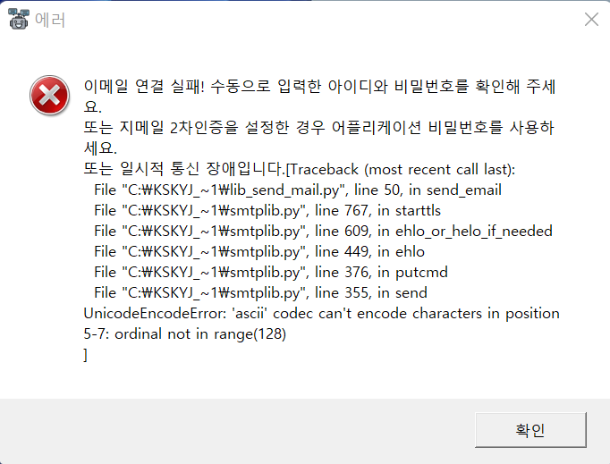

# \[필독]자주하는 질문(FAQ)

## 처음 설치했습니다. 무엇을 해야하나요?


아래 처음 설정하기 반드시 하고, 아래 퀵가이드 참고하면 됩니다. 이 FAQ도 참고하세요 :smile:



[init1](init1/)



[faq.md](faq.md)


## **각 기능에 대한 설명은 없나요?**


* 세부적 설명은 도움말 > 화면 기능 설명
* 다양한 기능들이 존재하며 프로그램의 \[설정] \[종목조회]\[실현손익]등 버튼을 실행하면 기능 및 설명이 나옵니다
* 더욱 자세히 알고 싶다면 도움말 > 릴리즈 노트 와 네이버까페의 \[개발일지] \[업데이트] 참고

[https://cafe.naver.com/infinitebuying/3548](https://cafe.naver.com/infinitebuying/3548)



[detail.md](detail.md)


## 메리츠증권  HTS실행이  안되고ScformMngr.dll 을 Load할수 없다고 나옵니다.

<figure><figcaption></figcaption></figure>


설정 > 일반 / 화면 > 모든 RPA > HTS 실행방식변경
\
을 `체크`하고 저장후 닫기 하고 다시 시도하세요


## 키움증권에서 SOXL주문시 ERROR\_CODE(14) 주문검증 실패가 발생합니다.


키움 글로벌이 SOXL이 영국장이 생기면서, 영웅문에서 추가 설정을 해줘야 합니다.

[https://fragilememor.gitbook.io/kskyj-rpa-kium/init1](https://fragilememor.gitbook.io/kskyj-rpa-kium/init1) > 2.영웅문 기본환경 설정을 참고하세요.


## 주문시 ERROR\_CODE(14) 주문검증 실패가 발생합니다.


[https://fragilememor.gitbook.io/genie-rpa/issue\_solved/solved4](https://fragilememor.gitbook.io/genie-rpa/issue_solved/solved4) 참고하여 전원설정 고성능으로 변경하세요.

그래도계속 발생 하는 경우 설정 > 일반/화면 > 동작 대기 딜레이 값을 0.3 정도 증가시키세요.


## 주문 불가능한 날입니다, 매도 수량이 없습니다. 투자동의 하십시오 등의 메시지가 나오며, 잔고 가져오기, 매매가 되지 않습니다.


이 RPA는 영웅문Global(HTS)에서 RPA를 사용하지 않고 직접 사용시 정상거래가 되야 동작합니다. 표시되는 메시지는 프로그램 오류가 아니고, HTS메시지로 휴장이거나, 이미 매도가 들어가서 매도 수량이 없거나 투자유의 동의를 안해서 안되는 것입니다.


## 동작이 제대로 되지 않는것 같습니다.


아래 에러상황 및 해결 가이드 참고하세요.



[error\_code.md](issue_solved/error_code.md)


## 모니터 화면을 보면서 하면 잘되는데, 화면없이 완전자동화를 하면 동작을 하지 않습니다.


* 해당 프로그램은 디스플레이 출력 좌표를 활용합니다. 즉 노트북 또는 모니터 연결이 최소 1개는 되어 있어야 합니다.
* amazon 등의 클라우드 또는 NAS에서 하는경우, 크롬 원격제어를 통해 디스플레이 출력을 해야합니다. 원격제어를 진행하고 원격제어 프로그램에서 접속 종료로 하면 디스플레이 출력이 끊어지므로, 그냥 원격제어 프로그램을 최소화 시켜도 유지됩니다.
* Vultr의 경우 별도 작업없이 디스플레이 출력이 있습니다.
* hdmi 더미 플러그등을 구매하여 본체에 장착하여 사용하면 됩니다.
* software 로 하는방법도 있습니다. 아래링크 참고하세요
  * [https://fragilememor.gitbook.io/kskyj-rpa-kium/advanced\_setting/nomonitor](https://fragilememor.gitbook.io/kskyj-rpa-kium/advanced_setting/nomonitor)


## 윈도우 사용자 계정 컨트롤 때문에 자동으로 넘어가지 않습니다.

 (1) (1) (1).png>)


[https://fragilememor.gitbook.io/genie-rpa/issue\_solved/uac](https://fragilememor.gitbook.io/genie-rpa/issue_solved/uac)


## VR과 무한매수법 한계좌에 하고 있어 TQQQ가 매매 항목에 들어갑니다. TQQQ매매를 빼거나 안하는 방법은 없나요? 즉 특정종목을 제외하고 싶습니다.

.png>)


설정 > 매매 기본값 > 매매 제외 종목 에 TQQQ를 추가하세요.


## 매매를 하고 싶은 종목 추가는 어떻게 하나요?신규 매매한 종목이 매매현황판에 추가가 안됩니다.

.png>)


기본적으로 무한매수법 종목은 추가되어 있으며, BULZ와 같은 종목이 매매현황표에 나오지 않는다면 설정 > 매매 기본값 에 종목을 대문자로 추가해야 합니다.


## 종목조회 / 신규 매수에 특정 종목이 나오지 않습니다.


설정 > 매매 기본값 의 종목 메뉴에 특정 종목을 추가하세요. 단 추가할 경우 매매현황판에 종목이 추가되어 원치 않는 종목 매매를 하게 될 수 있습니다.


## **매수중단은 어떻게하나요?**

.png>)


매수 중단은 종목가져오기/자동계산 실행시 진행률에 따라 100%가 넘는경우 자동으로 체크되고 100% 미만인경우 자동으로 해제 됩니다. 즉 자동으로 관리되며, 수동으로 하려면 일시적으로 종목가져오기/자동계산후 매매를 시작하기 전에 수동으로 체크한다면 매수시 체크상태에 따라 매수를 수행합니다. 계속 수동으로 관리하려면 설정 > 스마트비서 > 진행률에 따라 매수중단 자동관리 체크를 해제하면 수동으로 관리되며 체크내역이 저장됩니다. 단 진행률 100%가 넘어가도 매수를 중단하지 않습니다.


## 매도중단은 어떻게 하나요?

 (1) (1).png>)


매도가 비율에서 중단을 선택하면 됩니다.



매도중단의 경우 매수는 하되 매도중단만 하는경우 사용하며, 무한매수법을 사용하지 않을 경우 설정 > 매매기본값에서 매매제외할 종목에 추가하세요.


## 무한매수법 말고, QLD, TQQQ 적립으로 매수만 할 수는 없나요?


1. 설정 > 매매 기본값 > 종목 가져오기,... 옵션에 QLD를 추가
2. 매매현황판에서 QLD의 종목별 원금 및 원금분할 입력
3. 매매현황판에서 무매법종류에서 무지성 매수 선택



무한매수법 종목과 한 계좌에서 적립 하는 경우, 종목별 원금 합산을 피하기 위하여, 다계좌 런처를 사용하여 동일 계좌라도 다른 RPA에서 관리 할 수 있습니다.


## **영웅문Global 자동로그인 인증방법은 어떤것을 사용해야 하나요?**


간편인증, 공동인증서 전부 지원하며, 로그인수단 순서에 실제 선택해서 로그인하는 번호를 적어야 합니다.


## **계좌를 여러개 사용하거나 여러 사람이 이용하려면 계좌나 인증순서를 바꿔가면서 이용해야 하나요? 이렇게 이용하면 마지막 매매기록만 저장됩니다.**


메인화면의 \[다계좌/자동화]를 눌러서 다인용 런처를 실행합니다. 계좌별, 사용자별(이름 및 인증수단 순서)로 설정해서 사용해야 합니다. 각 계좌, 사용자마다 프로그램을 실행하고 설정을 각각 해야 합니다.

상세내역은 아래 메뉴얼을 참고하세요.



[launcher.md](launcher.md)


## **프로그램 동작이 이상하거나 자꾸 파일이 삭제됩니다. 백신 예외 설정 어떻게 해야하나요?**


백신이나 윈도우가 최신업데이트인 경우 기본적으로 백신예외 설정 안해도 됩니다. 최신인데도 안된다면 도움말 > 문제해결하기 > 백신 예외설정 참고하세요. V3등과같이 윈도우 기본백신이 아니거나 여러개인 경우 각 백신/보안프로그램 마다 프로그램 설치 폴더 경로 예외설정을 해야합니다. 각 백신 예외설정법은 네이버,구글 검색하세요.



[antivirus.md](issue_solved/antivirus.md)


## 매매현황판의 전일 매매 개수가 맞지 않습니다.


해당정보는 영웅문Global(HTS)의 2150메뉴의 전일/금일 매매한 정보를 가져오는 것으로 매매후 3영업일간 데이터가 표시됩니다. RPA 프로그램에서 따로 계산한것이 아닙니다.


## **스마트 RPA는 언제부터 사용 가능한가요?**


프리장부터 가능하며 매도는 After장까지 유지됩니다.


## **스마트 RPA로 예약매매는 안되나요?**


예약매매를 하는 경우 프리장, After장에 주문이 유효하지 않고 본장에서만 되기 때문에 불리하여 지원하지 않습니다.


## **업데이트는 꼭 해야하나요?**


프로그램 시작시 자동 업데이트 감지되면 업데이트 하는것을 권장 합니다. 최신버젼이 아니면 문제가 발생해도 지원을 받을 수 없습니다.


## 업데이트시 다음파일을 열수 없습니다. 란 경고가 나옵니다.


실행중인 RPA프로그램을 종료하고 설치하세요.


## **주문완료 메일이 수신이 될때 있고 안될때 있습니다. 또는 메일이 늦게 옵니다.**


테스트메일이 정상으로 오지 않는다면, kskyjrpa로 시작하는 메일주소가 스팸으로 설정되어 있는지 확인하세요. 테스트메일 및 주문완료 메일 수신이 정상적으로 안되면, 사용자가 많아서 그렇습니다.

설정 > 스마트비서 > 보내는 메일 계정을 \[수동] 으로 설정하고, 수동 설정한 지메일 주소로 메일 알리미(구 죠르디)를 설정해야 합니다.


## **메일은 오는데 카카오톡으로 알림 안됩니다.**


kakao.com 메일을 사용해야 하며 RPA가 보내는 모든 메일주소(kskyjrpa@gmail.com, kskyjrpa2\~4@gmail.com) 모두를 메일 알리미(구 죠르디)에서 관심친구로 등록해야 합니다.


## 계속 이메일 연결 실패라고 나옵니다.


지메일 2차 인증사용도 안했는데도, 계속 위와같이 에러가 발생하면, 윈도우 > 제어판 > 시스템 > 정보 에서 컴퓨터 이름이 한글로 되어 있다면 영문으로 변경해주세요.


## **전체적으로 동작이 천천히 실행됩니다. 더 빠르게 동작할 수 없나요?**


설정 > 일반/화면 > 전체 딜레이(천천히 실행) 체크가 되어있다면 해제하세요. 또한 동작 대기 딜레이도 기본값도 동작에 문제가 없을 경우 기본값 0.2보다 낮게 사용해도 됩니다.


## 프리장서 원화주문 자동으로 할수 있나요?


키움에서 프리장 \~ 오후 7시 이전에는 원화주문이 자동으로 동작하지 않습니다. 무조건 수동으로 해야하는데, 프로그램에서 자동으로 해줍니다. 설정 > 스마트비서 > 프리장 오후 7시 이전 원화주문 자동설정 체크해주세요.


## **종목가져오기를 실행하면 영웅문 Global(HTS)가 종료됩니다.**


영웅문 Global(HTS) 가상화면 6번에서 매매외에 다른창이 열려 있는 경우 발생할 수 있으며, 수동으로 창을 모두 닫고 시도하세요.


## **간헐적으로 실현손익, 예수금이 #N/A로 나오거나 매매가 정상적으로 되지 않습니다.**


주로 노트북에서 발생하며, 문제 해결하기 > 전원설정변경 또는 딜레이 설정 또는 영웅문 글로벌(HTS)알림 제거를 참고하십시오.


## **매도된것이 없는데, 실현손익이 조금씩 변동이 됩니다.**


실현손익은 환율에 따라 변동됩니다. $는 그대로며 원화만 환율에 따라 변동됩니다.


## 완전자동화(Full Automatic Mode)할때 윈도우 로그인이 자동으로 되야하나요?


네. 비밀번호 없이 바탕화면이 보이는 상태로 자동으로 로그인되야 합니다.


## 완전자동화(Full Automatic Mode)를 위해 컴퓨터를 자동으로 켜지게 하려면 어떻게 해야하나요?


우선 컴퓨터의 메인보드가 지원되야하고, 참고로 국내 노트북은 거의 안됩니다.(그냥 켜놓고 절전모드로 변경하시길 권장합니다.) BIOS 설정을 통해 \[전기신호가 감지될 경우 켜짐 / 특정시간에 켜짐 ] 둘중에 하나는 있어야 합니다. 상세내용은 메뉴얼의 Full Automatic Mode(완전 자동화) 설정 및 응용을 참고하세요.



[fullautomatic.md](advanced_setting/fullautomatic.md)


## 완전자동화(Full Automatic Mode)를 위해 컴퓨터 BIOS설정을 변경하였으나, 윈도우가 안켜집니다.


제어판>전원옵션>전원단추 작동설정에서 빠른시작켜기 체크해제 해보세요.


## **완전자동화시 모니터나 화면접속을 꼭 해야하나요? 클라우드 PC등의 윈도우 호스팅을 통해 사용은 어떻게 하나요?**


모니터는 꺼져있어도 됩니다. PC인경우 모니터를 안켜도 되고, 노트북의 경우 제어판 > 전원옵션 > 디스플레이를 끄는 시간 설정 > 디스플레이 끄기 설정해서 사용해도 됩니다. 단 PC나 클라우드 , 호스팅같이 모니터 자체가 없는 경우에는 크롬 원격데스크톱 으로 1회 연결하고 정상적으로 원격접속종료 안하고 어플리케이션 꺼서 디스플레이 가상으로 유지되게 두어야 합니다.



Vultr을 사용하는 경우 기본 View Console 로 접속하고 종료해도 디스플레이 유지됩니다.


## 완전자동화가 컴퓨터 키자마자 하면 잘안됩니다.


완전자동화 시작전 컴퓨터를 3\~5분정도 여유있게 켜야합니다. 윈도우 특성상 키자마자 프로그램이 실행안될수도 있습니다.


## 완전자동화 자등등록시 새벽에 거는 경우 토요일은 왜 등록하나요?


스케줄을 새벽에 실행하면, 한국시간 토요일까지 미국장이 열리기 때문입니다.


## Vultr, Amazon, 가상머신에서 영웅문Global 간편인증이 안됩니다. 자꾸 영웅문Global이 종료 됩니다.


영웅문Global은 가상머신에서 간편인증이 안되게 되어 있습니다. RPA 프로그램이랑 관계 없습니다. 공동인증서만 가능하며, 간편인증을 선택해서 영웅문Global이 종료되는 경우 영웅문을 재설치 하고 공동인증서를 선택하세요.


## 영웅문 자동로그인이 안됩니다. 공동인증서 첫번째로만 로그인 됩니다.


우선 RPA에 로그인 비밀번호가 정상적으로 입력됬는지 확인하세요.

[https://fragilememor.gitbook.io/kskyj-rpa-kium/issue\_solved/antivirus](https://fragilememor.gitbook.io/kskyj-rpa-kium/issue_solved/antivirus)

설정을 확인하세요.

계속 안되는 경우 설정 > 일반/화면 에서 ㅁ\[OLD]영웅문 Global 로그인을 체크하세요. 단 해당 기능은 윈도우 화면 배율 100% 에서만 동작하고, 로그인시 자동팝업에 체크 되어 있어야 합니다.


## 프로그램 보안상 안전한가요?


제 프로그램은 보안요소 참고([https://cafe.naver.com/infinitebuying/5163](https://cafe.naver.com/infinitebuying/5163))하시고, 지금은 편의상 공인인증서 비밀번호도 저장합니다. 계좌비밀번호는 저장하는것 자체가 없습니다.(메리츠는 저장합니다)

* 개발자는 비밀번호를 알수 있는가?

암호화된 비밀번호를 복호화해서 입력할때 그 내용을 별도로 개발자에게 전송을 하면 알수 있겠지만 비밀번호를 전송하지 않습니다. 이 프로그램이 아니더라도 키움증권사 프로그램이나 모든 로그인 등을 만든 개발자가 악의적인 마음을 가지면 비밀번호 수집이 가능합니다. 즉, 이건 프로그램 신뢰의 문제라고 생각합니다. 궁금하시면 와이어샤크등을 통해 패킷으로 비밀번호를 별도로 다른곳에 전송하는지 확인해보시면 알수 있습니다.

* 해킹위험성은?

일단 암호화해서 저장하기 때문에, 일반적으로는 힘들고, 특수한방법을 써야합니다.(방법노출될까봐 자세히 이야기는 안하겠습니다) 허나 이를위해서는 개인PC 접속도 뚫어야하고, 키움증권 구동시 안랩보안프로그램도 뜨는데 그것도 우회해야하고, 그리간단하지는 않습니다.

설사 어떻게던 알아냈다고 쳐도 할수있는건 매수, 매도말고는 없습니다.

돈이나 증권을 본인계좌가 아닌 다른계좌로 인출하는건 계좌비밀번호도 알아내야하고, otp등의 별도 추가 인증이 필요합니다.

가장 좋은건 인증방법을 간편인증으로 하는것을 권장합니다.(메리츠 증권은 간편인증으로 하면 QR 로그인을 해서 자동화가 안됩니다.) 어떻게던 유출되더라도 지정된 기기에서만 동작하기때문에 추가보안효과가 있습니다.

결론은 암호화 저장되있고, 간편인증 권장하며, 유출되도 매수 매도 말고는 할수있는게 없습니다. 개발시 안전은 1순위로 중요하게 생각했던 부분이라 크게 걱정안하셔도 됩니다 :)


## 윈도우 화면 배율을 확대해서 사용중인데 RPA가너무 크게 보입니다.

 (1).png>)


* 바탕화면 지니RPA 마우스 우클릭후 속성을 누르고 위그림대로 호환성 설정 > 높은 DPI 설정 클릭후 위 그림처럼 2개 체크하고 확인 누르면 배율 100% 상태와 동일하게 나옵니다.
* 또는 설정 > 일반 에서 글꼴 크기를 조절하고 RPA를 재시작해주세요.


## 화면 오른쪽이 잘립니다.


우선 해상도를 높이면 해결됩니다. 해상도를 조절할 수 없는 환경이면, 설정 > 일반/화면 > 글자크기 에서 8\~9정도로 낮추세요. 프로그램 재시작 후 확인하세요.


## 무한매수법 V2.0, V2.1 사용중인데 매도가 3개가 보이지 않습니다


기본으로 숨겨져 있습니다. 표시를 하려면 설정>일반/ 화면 > (2.0, 2.1)매매현황판에 첫번째 분할 매도표시 체크하십시오. 숨겨져 있더라도 매도는 수행합니다.


## 매매현황판의 매수 가격이 어쩔때는 무한매수법 공식과 다른것 같습니다.

매매공식 계산은 아래링크 참고하세요

* [https://fragilememor.gitbook.io/genie-rpa/detail#ordermethod](https://fragilememor.gitbook.io/genie-rpa/detail#ordermethod)


매수시 주문거부가 되지 않도록 현재가 +15%와 비교해서 작은값으로 매수합니다.


## 평단매수, 큰수매수 개수가 이상한것 같습니다.


매수개수 구하는 방법은 아래를 참고하세요.

[https://cafe.naver.com/infinitebuying/39081](https://cafe.naver.com/infinitebuying/39081)


## 하락대비 추가매수(정액매수)는 무엇인가요?


라오어님 글 [https://cafe.naver.com/infinitebuying/17505](https://cafe.naver.com/infinitebuying/17505)

프로그램 기능 [https://cafe.naver.com/infinitebuying/36134](https://cafe.naver.com/infinitebuying/36134)


## 잔고가 모두 매도 되더라도 최초 신규매수 없이 매매법을 계속하고 싶습니다.


**설정 > 스마트비서 > 소진후 기존 정보로 신규 매수**

에 종목을 추가하면 됩니다.


## 설정한 원금을 소진(진행률 100%)하더라도 계속 매매를 하고 싶습니다.


**설정 > 스마트비서 > 진행률 100% 이상일 때 계속매수**

에 종목을 추가하세요.


## 지정가매도가격이 공식보다 조금 높습니다.


지정가 매도 가격은 수수료 및 제반비용을 고려하여 목표수익 비율을 맞출수 있는 기능을 제공합니다.

**설정 > 매매 기본값 > 매도가격 비율 소수점 을 통해 설정할 수 있습니다.**

**예를들어 수수료 0.07% 인 경우 10.17% 설정시 제반비용 감안하여 10% 수익으로 됩니다.**

공식과 동일하게 계산값을 하고 싶은 경우 소수점을 00 으로 설정하세요.


## 라오어님 무한매수법 V2.2 SOXL을 하려면 12%로 설정을 해야하는데 어떻게 해야하나요?


[https://cafe.naver.com/infinitebuying/53052](https://cafe.naver.com/infinitebuying/53052)

참고하세요.

