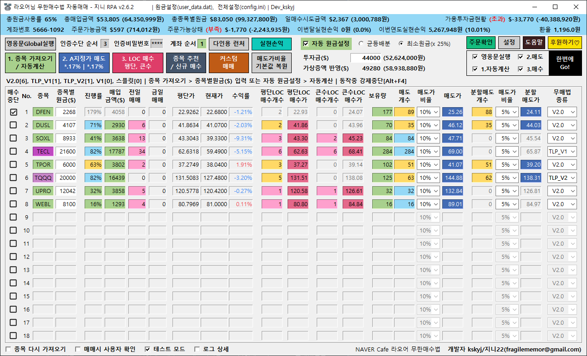

# \[필독]퀵사용가이드

### 처음실행&#x20;

1. 영웅문 Global 설치
2. 바탕화면의 kskyj RPA 실행
3. **인증 수단 순서와 인증비밀번호(간편인증/공동인증서)** 입력 후 \[영웅문 Global 실행] 클릭 (별도로 영웅문 Global 실행해도 무방)
4. **계좌 순서에 해당하는 계좌 입력 후** \[1. 종목 업데이트] 실행
5. 종목 옆에 종목별 설정한 **종목별 원금($)** 입력
6. 다시 \[1. 종목 업데이트] 실행**(업데이트 후 종목별 원금 자동저장)**
7. \[2.지정가 매도] 실행
8. \[3. LOC 매수 평단/큰수] 실행

**※ 한번에 Go!(스페이스바) 를 실행할 경우 왼쪽 체크 항목 따라 3\~8번 전부 자동 실행**

###

### 처음 이후 실행

1. 바탕화면의 kskyj RPA 실행
2. \[1. 종목 업데이트] 실행
3. \[2.평단 10% 지정가 매도] 실행
4. \[3.평단/큰수 LOC 매수] 실행

**※ 한번에 Go!(스페이스바) 를 실행할 경우 왼쪽 체크 항목 따라 1\~4번 전부 자동 실행**

****

### 그외 다양한 기능 사용

설정 버튼을 클릭하면 다양한 기능에 대한 설명 및 사용 가능합니다.

구동중 문제가 있거나 궁금한 사항은 FAQ먼저 확인하세요 :0


[faq.md](faq.md)


