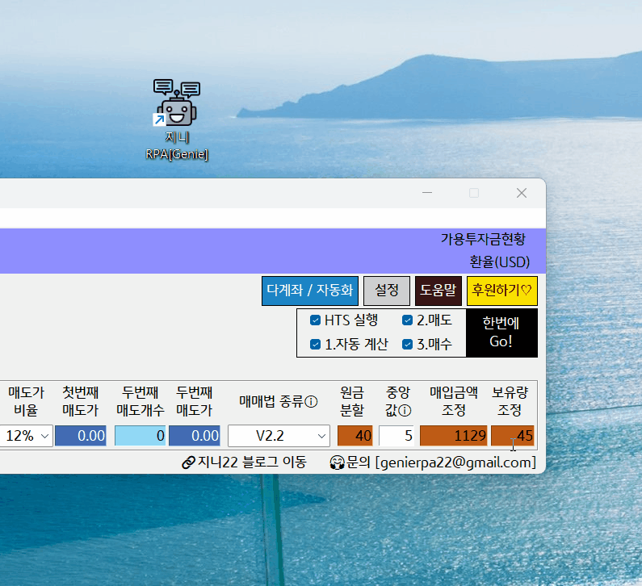

# \[필독]퀵사용가이드

### 프로그램 실행

<figure><figcaption></figcaption></figure>

설치하면 바탕화면에 자동으로 `지니 RPA(Genie)` 아이콘이 생성됩니다. 해당 아이콘을 마우스로 클릭하세요.

### 인증 설정


HTS, 인증서, 계좌 설정을 하는 것으로 변동사항이 없으면 최초 1번만 설정 하면 됩니다.


<figure><figcaption></figcaption></figure>

1. 바탕화면의 지니 RPA 실행
2. 설정 > 일반 / 화면 > 개인화
   1. 사용자 이름 입력
   2. HTS 선택
   3. 인증서 순서 입력
   4. 계좌 순서 입력
   5. 비밀번호 관리 클릭
      1. 인증서(공동/간편) 비밀번호 입력
      2. 계좌 비밀번호 입력(키움증권 해당없음)
      3. 저장후 닫기

### 매매현황판 종목 설정

1. \[1. 종목 가져오기 / 자동계산] 실행
2. 매매현황판에종목 설정
   1. 종목별 설정한 종목별 원금($)
   2. 매매법 종류
   3. 원금분할
3. 다시 \[1. 종목 가져오기 / 자동계산] 실행 하면 자동계산이 됩니다.
4. 맨 오른쪽 \[한번에 Go!] 실행(스페이스바) 또는 \[2.매도], \[3.매수] 실행


한번에 Go! 외에 \[매도], \[매수] 버튼으로 별도 매매 가능 합니다.



\[1. 종목 가져오기 / 자동계산] 은 종목을 가져오기 한 이후에는 자동계산 만 수행됩니다.

즉, 종목 정보를 가지고 와서, 매매현황판의 원금, 매매법 종류, 원금분할을 변경하면 자동으로 계산 합니다.


### 처음 이후 실행

1. 바탕화면의 지니 RPA 실행
2. \[HTS 실행] 실행
3. \[1. 종목 가져오기 / 자동계산] 실행
4. \[2. A지정가 매도] 실행
5. \[3. LOC 매수 평단, 큰수] 실행


**한번에 Go!(스페이스바) 를 실행할 경우 한번에Go! 체크 항목 따라 2\~5번 전부 자동 실행**


### 그 외 다양한 기능

\[설정], \[종목조회 / 신규매수], \[실현손익], \[다인용런처] 버튼을 클릭하면 다양한 기능에 대한 설명 및 사용 가능합니다.


구동중 문제가 있거나 궁금한 사항은 FAQ먼저 확인하세요 :0



[faq.md](faq.md)

