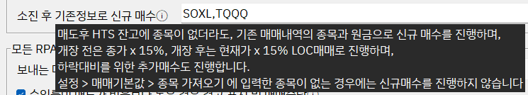
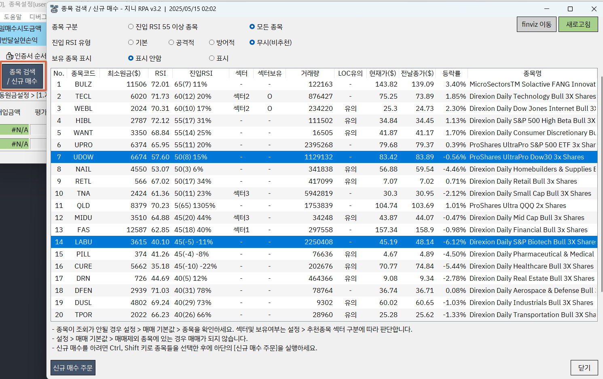

# 📈 사이클 끝나고, 신규매수 하는법

### 1. 소진 후 기존정보로 신규매수(추천)

* "설정 > 스마트비서 > 소진 후 기존정보로 신규매수" 에 원하는 종목을 입력합니다.
* 종목이 여러개인 경우 , 로 입력합니다.
* 입력된 종목은 설명대로 x 15% 로 매수 합니다.
* 해당 방법은 소진되면 자동으로 매수를 하기 때문에 편리합니다. 단 바로 진입을 하기 때문에 텀을 두고 진입하려면 해당기능을 사용하지 않거나, 매수가 된것을 취소해야합니다.

### 2. 수동 매수

* 수동으로 일매수시도 금액 만큼 매수하거나, 1개 매수해서 잔고에 종목이 있도록 합니다.(지정가 매수 등등)
* 잔고에 종목이 존재하면 자동으로 가져오고, 자동계산을 수행합니다.

### 3. 신규 매수 기능

1. 종목 검색 / 신규 매수 버튼을 클릭합니다.
2. 조건에 따라 종목을 선택합니다.
3. 신규 매수할 종목을 선택합니다. 여러개 인 경우, Ctrl + Shift + 클릭으로 선택합니다.
4. 매수할 종목을 선택한 후, \[신규 매수 주문] 버튼을 클릭하면, 매매현황판에 추가됩니다.
5. 매매현황판에서 추가한 종목들의 원금, 매매법 종류, 원금분할을 설정합니다.
6. \[종목 가져오기 / 자동계산] 버튼을 클릭하면, 자동계산을 수행합니다.
7. \[한번에 Go!] 버튼 또는 매수를 클릭하면, 매수 주문이 실행됩니다.

### 매매현황판 초기화

* 신규 종목 추가하고나서, 필요하지않을경우  초기화를통해 제거할 수 있습니다.
